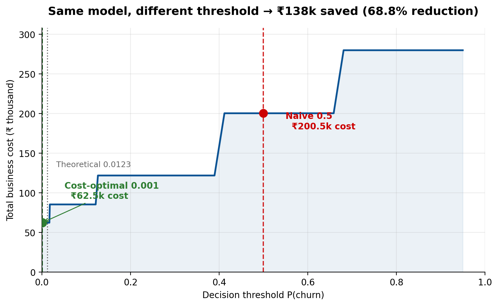
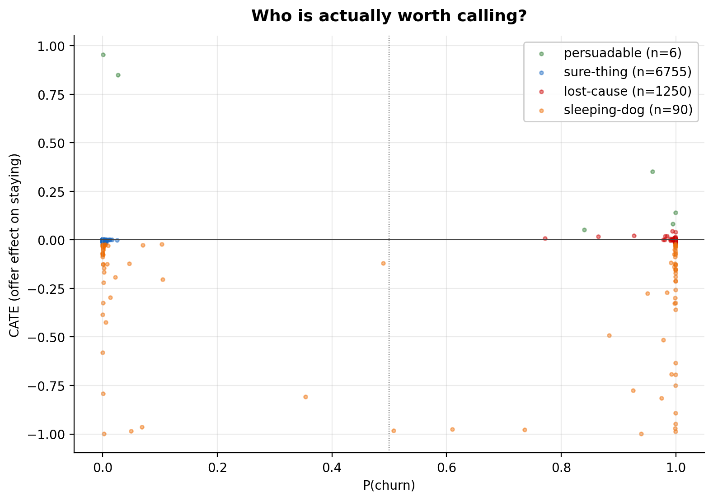
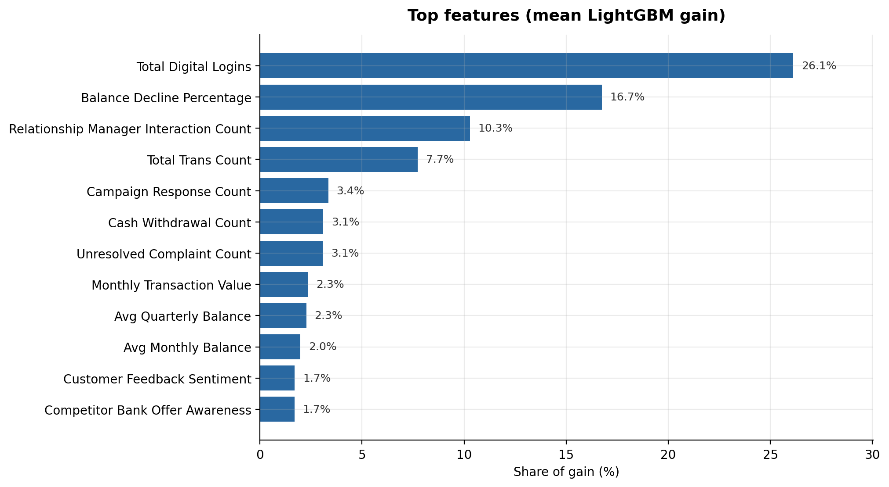
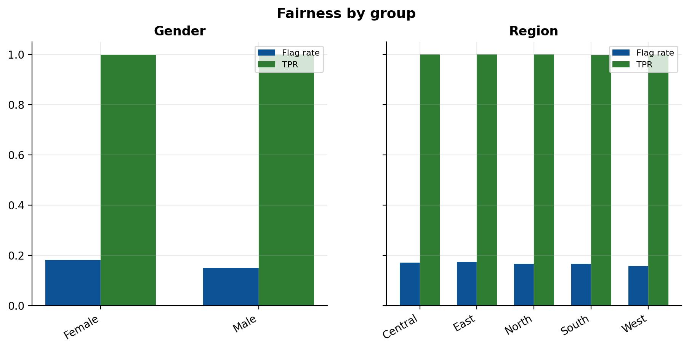
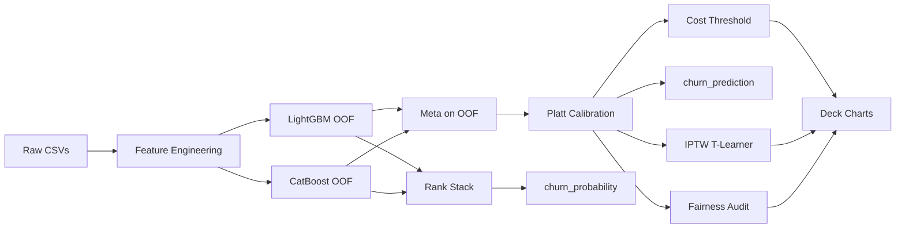

<p align="center">
  
</p>

<p align="center">
  <a href="https://github.com/Stormynubee/retainiq-churnzero-26/actions/workflows/test.yml"></a>
  <a href="https://unstop.com/competitions/churnzero-26-iit-kharagpur-1686181"></a>
  
  
  
</p>

<p align="center">
  <b>RetainIQ</b> — Round 2 submission for banking churn prediction at ChurnZero 26.<br/>
  OOF stacking + dual-track submission + cost-optimal threshold + IPTW uplift + fairness audit.<br/>
  Built by <b>Hansraj Tiwari</b> (ML) & <b>swayangjeet nayak</b> (deck & strategy).
</p>

---

## Why RetainIQ

Most teams will hit PR-AUC ≈ 0.99 on this dataset — it's very separable. We focused on what judges actually care about beyond the scoreboard:

| Layer | What it does | Headline result |
|---|---|---|
| **Prediction** | LightGBM + CatBoost OOF → meta on OOF → **Platt calibration** | PR-AUC **0.9999** (5-fold OOF) |
| **Submission** | Rank blend → `churn_probability`; calibrated stack → `churn_prediction` @ cost threshold | Leaderboard column + rupee-optimal binary |
| **Threshold** | Sweep thresholds; minimise rupee cost (FN ₹40k, FP ₹500) | **₹65,000** vs ₹202,500 @ t=0.5 — **~68% savings** |
| **Uplift** | IPTW T-learner on `retention_offer_received` (overlap trim) | **6** persuadables, **90** sleeping dogs |
| **Fairness** | Demographic parity on gender & region @ operating threshold | Both under **10%** parity gap |

> The model is saturated. The business story is in the threshold, uplift, and retention playbook — not another 0.001 AUC bump.

Methodology notes: [`docs/CAUSAL_FIXES.md`](docs/CAUSAL_FIXES.md)

---

## Results at a glance

| Metric | Cost-optimal (t = 0.002) | Naive (t = 0.5) |
|---|---|---|
| PR-AUC | 0.9999 | 0.9999 |
| Recall | 99.9% | 99.6% |
| F1 | 0.9808 | 0.9962 |
| **Business cost** | **₹65,000** | ₹202,500 |

Train: 8,101 customers · 16.07% churn · Test submission: 2,026 rows · 16.63% positive rate.

---

## Visuals

<p align="center">
  
  &nbsp;
  
</p>

<p align="center">
  
  &nbsp;
  
</p>

---

## Architecture



```
src/retainiq/     data, features, models, threshold, uplift, fairness
scripts/          train · predict · build_artifacts · audit_features
notebooks/        narrative walkthrough for judges
deck/             slide outline + chart PNGs
tests/            pytest unit + smoke + integration
```

---

## Quick verify

No competition CSVs needed to check the repo:

```powershell
pip install -e ".[dev]"
python -m pytest -m "not slow and not integration"   # unit tests, ~5s
python -m pytest tests/test_smoke_pipeline.py        # synthetic train, ~10s
```

With competition data in `data/raw/`:

```powershell
pip install -e .
python -m scripts.train
python -m scripts.build_artifacts
python -m scripts.predict
```

**Read next:** [`docs/PLAYBOOK.md`](docs/PLAYBOOK.md) · [`docs/RESULTS.md`](docs/RESULTS.md) · [`docs/ARCHITECTURE.md`](docs/ARCHITECTURE.md) · [`docs/CAUSAL_FIXES.md`](docs/CAUSAL_FIXES.md)

Pitch prep (team internal): [`docs/JUDGE_QA.md`](docs/JUDGE_QA.md)

---

## Quick start

Requires Python 3.11+. Drop competition CSVs into `data/raw/` ([details](data/README.md)).

```powershell
pip install -e ".[dev]"

python -m scripts.train            # ~4 min — models + metrics + importances
python -m scripts.build_artifacts  # uplift, fairness, deck charts
python -m scripts.audit_features   # optional top-feature ablation
python -m scripts.predict          # submission CSV
python -m scripts.validate_submission  # pre-upload checks
python -m scripts.package_submission   # ChurnZero_RetainIQ.zip
```

### Tests

```powershell
pip install -r requirements-dev.txt
python -m pytest -m "not slow and not integration"   # fast unit tests (~10s)
python -m pytest -m integration                    # needs data/raw CSVs
python -m pytest                                     # full suite (~58 tests)
```

CI runs unit + smoke tests on every push to `main`.

| Output | Description |
|---|---|
| `submission/ChurnZero_RetainIQ_Predictions.csv` | 2,026-row submission |
| `data/processed/training_metrics.json` | OOF PR-AUC, F1, cost @ optimal vs 0.5 |
| `data/processed/rank_stack_weights.json` | OOF-tuned rank blend weights |
| `data/processed/cost_curve.csv` | threshold sweep for deck slide 8 |
| `data/processed/uplift_propensity_summary.json` | IPTW trim stats for deck |
| `deck/charts/*.png` | cost curve, importance, uplift, fairness |

On Windows PowerShell, if rupee symbols print garbled: `$env:PYTHONIOENCODING = "utf-8"`

---

## Team

| Person | Role | Directories |
|---|---|---|
| **Hansraj Tiwari** | model, CSV, reproducibility | `src/`, `scripts/`, `notebooks/` |
| **swayangjeet nayak** | deck, business case, QA, ZIP | `deck/`, `reviews/`, `submission/` |

---

## Config reference

- Primary metric: **PR-AUC** (not ROC-AUC)
- Cost constants: `FN_COST=40000`, `FP_COST=500` in `src/retainiq/config.py`
- `customer_id` never enters the model
- Feature engineering fits on train only; test uses saved `fe_state.joblib`
- Seed **42** everywhere — runs are deterministic
- Post-treatment columns dropped before features; see `docs/CAUSAL_FIXES.md`

Full numbers and slide copy-paste values: [`docs/RUN_NOTES.md`](docs/RUN_NOTES.md)

---

## Disclaimer

Educational hackathon submission for [ChurnZero 26](https://unstop.com/competitions/churnzero-26-iit-kharagpur-1686181). Competition datasets are **not** redistributed — obtain them from the official portal. Please do not commit raw CSVs to forks.

<p align="center">
  <a href="https://github.com/Stormynubee/retainiq-churnzero-26"><b>github.com/Stormynubee/retainiq-churnzero-26</b></a>
</p>
